# Zero to AI Application: infusing your projects with intelligence
 
Sometimes it can be hard to get 'buy in' from investors or management when you have an idea for an AI application. You can talk about the idea, maybe produce some mock-ups, possibly walk through your algorithm design? 

 
But … wouldn't it be brilliant to provide your team with a Proof-of-Concept application, infused with intelligence, that took you the fraction of the time to build? Could showing something ‘real’ really test the viability of an idea and gain buy-in for further development?

 
In this interview, Amy will show you how she has built a prototype application infused with intelligence using Azure Platform-as- a-Service (PaaS) offerings such as [Azure Custom Vision service](https://docs.microsoft.com/en-us/azure/cognitive-services/custom-vision-service/home/?WT.mc_id=build2019-event-amynic), [Azure Logic Apps](https://docs.microsoft.com/en-us/azure/logic-apps/logic-apps-overview/?WT.mc_id=build2019-event-amynic) and [Microsoft PowerApps's](https://docs.microsoft.com/en-us/powerapps/powerapps-overview/?WT.mc_id=build2019-event-amynic) platforms. By linking these services together you can build reliable, scalable AI applications and get your customers testing them as soon as possible. 

 
Take some time after the session to give-it-a-go yourself by following instructions below of how Amy built the solution.

# Pre-Requisties for your machine:
* Clone this repository to your local machine to gain images and code samples you need for the app: git clone https://github.com/amynic/zero-to-ai-app.git or choose 'Clone or Download' green button and then 'Download ZIP'
* Microsoft Azure Subscription - [sign up for free here](https://azure.microsoft.com/en-us/free/?WT.mc_id=build2019-event-amynic)
* Laptop with a modern web browser (Google Chrome, Microsoft Edge)

> All demos and content have been tested on a Windows PC, however all options should run from macOS and Linux machines as well. Please provide information via an issue or pull request if you have feedback

# Go to Sections:

* **Section 1: Azure Custom Vision** - Creating a Dog Classification Algorithm, [go to section](#azure-custom-vision-service)
* **Section 2: Azure Logic Apps** - Creating serverless process to analyse an image and email you, [go to section](#azure-logic-apps)
* **Section 3: Microsoft Powerapps** - Creating a front end application to take a picture of a dog and analyse it, [go to section](#microsoft-power-apps)

# Want to learn more about the services in this project??
After completeing the sample below be sure to check out [Microsoft Learn](https://docs.microsoft.com/en-us/learn/?WT.mc_id=build2019-event-amynic) for really great course content that will get you up-skilled in many different technologies. The relevant courses I would recommend after this project to have a look at the below:
* [Classify Images with the Microsoft Custom Vision Service](https://docs.microsoft.com/en-us/learn/modules/classify-images-with-custom-vision-service/?WT.mc_id=build2019-event-amynic)
* [Introduction to Azure Logic Apps](https://docs.microsoft.com/en-us/learn/modules/intro-to-logic-apps/?WT.mc_id=build2019-event-amynic)
* [Call an API from a Logic Apps workflow using a custom connector](https://docs.microsoft.com/en-us/learn/modules/logic-apps-and-custom-connectors/?WT.mc_id=build2019-event-amynic)
* [Lots of different Microsoft PowerApps modules for you to try](https://docs.microsoft.com/en-us/learn/browse/?resource_type=learning%20path&term=powerapps/?WT.mc_id=build2019-event-amynic)

# Azure Custom Vision Service
## Creating a Dog Classification Algorithm

Using Azure Custom Vision service you can start to build your own personalised image classification and object detection algorithms with very little code. In this section we will create a dog-breed classification algorithm using Dog images from the [ImageNet open dataset created by Standford University](http://vision.stanford.edu/aditya86/ImageNetDogs/)

We have 7 Classes of dogs each with 30 images (available in a .zip file [here](sample-images/dogs.zip))
* Beagle
* Bernese Mountain Dog
* Chihuahua
* Eskimo Dog (aka Husky)
* German Shepherd 
* Golden Retriever
* Maltese

There is also a set of test images (not for training) in this [.zip folder](sample-images/dogs.zip).

First create a Custom Vision instance in your Azure account. 

* Go to the [Azure Portal](https://ms.portal.azure.com) main dashboard. 
* Click 'Create a Resource' in the top left
* Search for 'Custom Vision' 
* On the description pane for Custom Vision click Create.
* Enter details to create
    * a name for the service 
    * select your subscription 
    * **[IMPORTANT]** Please choose **SOUTH CENTRAL US** as the data centre
    * Choose the S0 tier for both 'Prediction pricing tier' and Training pricing tier
    * select the resource group you created previously for this project (e.g. ainights)
    * Click Create
* 

Now we can build our classifier, navigate to [https://www.customvision.ai](https://www.customvision.ai/?WT.mc_id=build2019-event-amynic) and choose sign in. Sign in with your Azure credentials account

> Accept the terms and conditions box to continue

Once loaded choose 'New Project' which opens a window to enter details

* Name: choose a suitable name
* Description: add a description of the classifier (example shown in image below)
* Resource Group: choose the resource group you created your custom vision service in (example: ainights[SO])
* Project Types: Classification
* Classification Types: Multiclass (Single tag per image)
* Domains: General
* 

Choose 'Create Project' and you will land on an empty workspace like below


Now we can start adding images and assigning them tags to create our image classifier

In the top left, select 'Add images', browse for the first folder of images from the [.zip folder](sample-images/dogs.zip) - Beagle - and select all 30 of the images in the folder.

Add the tag 'beagle' to the Beagle dog images and select 'Upload 30 files'


Once successful you receive a confirmation message and you should see your images are now available in the workspace


Now complete the same steps of uploading and tagging images for the other 6 dog categories in the folder. For each type of dog:
* Click add images
* Select the 30 new dog images
* Add the class label (beagle, german-shepherd, maltese etc)
* choose upload
* confirm images uploaded into the workspace

Now you should have all categories uploaded and on the left hand side you can see your dog classes and you can filter depending on type of dog image


Now you are ready to train your algorithm on the dog image data you have uploaded. Select the green **'Train'** button in the top right corner

Once the training process is complete it will take you to the Performance tab. Here you will receive machine learning evaluation metrics for your model

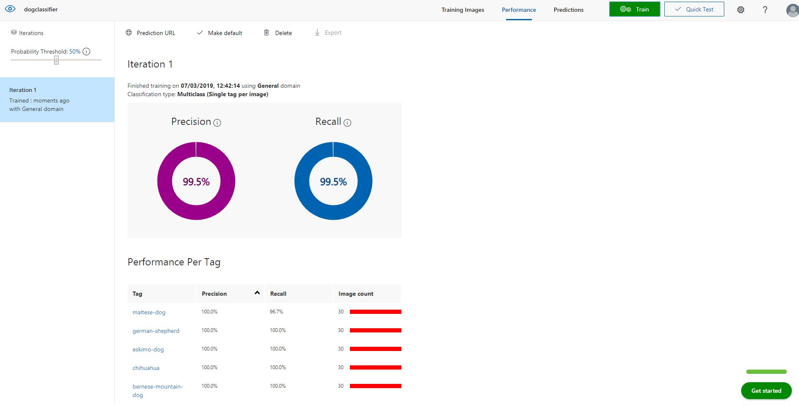

Now we have a model we need to test the model. Choose the 'Quick Test' button in the top right *(next to the train button)* this will open a window where you can browse for a local image or enter a web URL.

Browse for an image in the test folder (images the model have not been trained on) and upload. The image will be analysed and a result returned of what dog the model thinks it is (prediction tag) and the models confidence of its result (prediction probability)


> Repeat this process for other images in the test folder to see how the model performs

If you click on the **'Predictions'** tab on the top toolbar - you should see all the test images you have submitted. This section is for re-training, as you get new data you can add this to your model to improve its performance. The images are ordered by importance - the image, which if classified correctly, will add the most new information to the model is listed first. Whereas the last image might be very similar to other images already learnt by the model so this is less important to classify correctly.


To add these images to the model - select the first image, review the results the model provided and then in the 'My Tags' box enter the correct tag and click 'save and close'


This image will disappear from the  your predictions workspace and be added to the training images workspace. Once you add a few new images and tags you can re-train the model to see if there are improvements.

To use this model within applications you need the prediction details. Therefore, you have to go to the Performance tab from the top bar, click the **Publish** button and provide a name for this published iteration. 


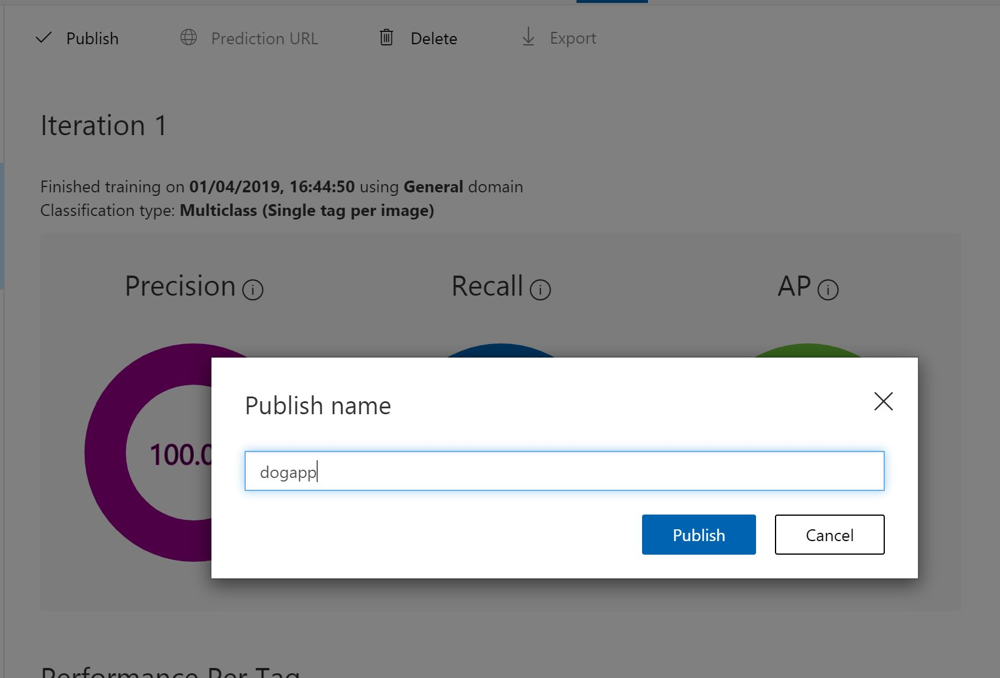

You can now select the **Prediction URL** button to gain all information you need to create a Postman call to your API, by setting the URL, the Header and the Body (using both an image or an image URL)


**Great work!** you have created your specialised dog classification model using the Azure Custom Vision Service

# Azure Logic Apps
## Creating serverless process to analyse an image and email you

In this section you will build an Azure Logic App to consume your Custom Vision AI dog classification application

First we need to create an Azure Storage Accounts.

Go to the azure portal and click create new resource in the top left corner. Select the section Storage and choose the first option Storage Account.


We are going to create a storage account for the images to be dropped into to be processed (called ainightstor)

On the storage account creation page enter options to setup your storage account:s

* **Subscription:** choose your subscription
* **Resource Group:** choose the resource group you have been using for this application (e.g. ainights)
* **Storage Account Name:** (must be unique) enter an all lowercase storage account name. *Such as ainightsstor(yourname) - append your name to the end of the storage account name so you know its unique (remove the brackets)*
* **Location:** your closest data center
* **Performance:** Standard
* **Account Kind:** Blob Storage
* **Replication:** Locally-redundant storage (LRS)
* **Access Tier:** Hot

Select **Review + create**, confirm validation is passed and then select **Create**


Once your deployment is complete, got to the resource and review the account settings.
Select **Blobs** to review your empty blob storage account.


We need to add a container to the storage account to store our images and results.

Select the **+ Container** button and create a name for the container for example the **ainightsstor** account would have an **images** container/folder 

For the public access level setting select **Container (anonymous read access for containers and blobs)**


Now we will create a Logic App - this will connect your image storage account to your AI classification service and send you an email with the results

Head to the Azure Portal Homepage. We are going to use Event Grid, a service that detects triggers in an Azure subscription (in our case, when a new blob is created in your Azure Storage account). Before we build with this - we must register it.

Got to subscriptions in the left panel, select your subscription and find Resource Providers in the left pane. Once the resource providers are listed - search "event" and select **Microsoft.EventGrid**.

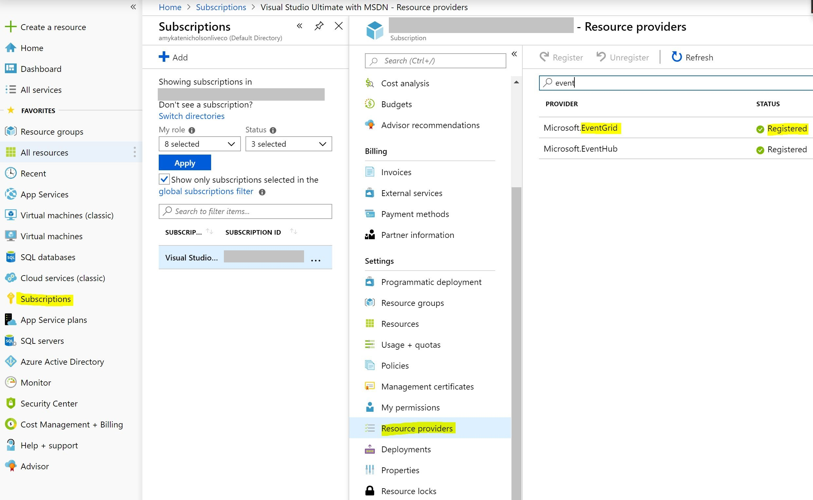

If this is not already status registered, select **register** from the toolbar


Once registered with a green tick - go back to the Azure Portal Homepage. Select **Create a Resource**. Type Logic App and select the service


Create the logic app by entering some setup detail like below:
* **Name:** suitable name for the dog classification application
* **Subscription:** Choose your subscription
* **Resource Group:** (use existing e.g. ainights) select the resource group you have been working for the whole workshop
* **Location:** choose the data center closest to you
* **Log Analytics:** off

Choose **Create**

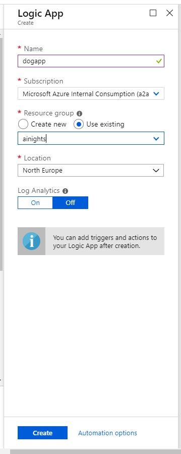

Once created, go to resource. From here we can create our logic process. Select **Logic app designer** from the left menu and then the  **When an Event Grid resource event occurs** option

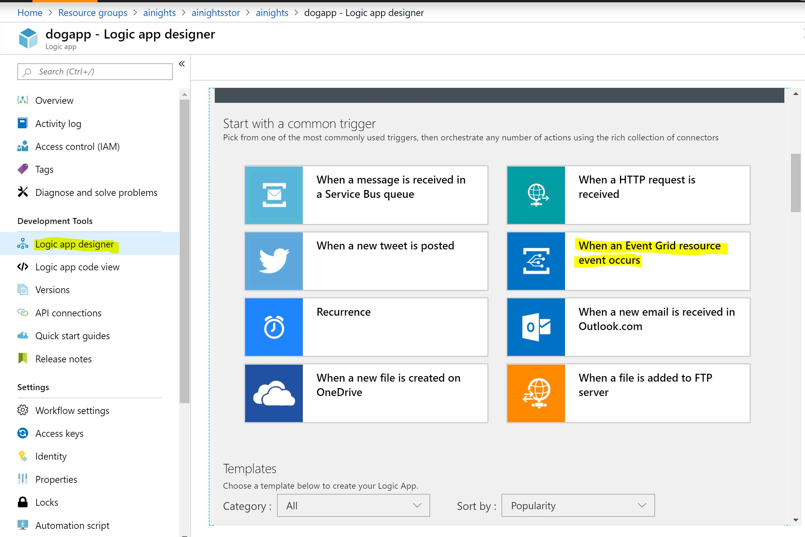

Connect to Azure event grid by signing in using your Azure credentials


Once connected and you see a green tick, select continue.

Select the options below:
* **Subscription:** your subscription
* **Resource Type:** Microsoft.Storage.StorageAccounts
* **Resource Name:** choose your image storage account (e.g. ainightsstor)
* **Event Type Item - 1:** Microsoft.Storage.BlobCreated


Then choose next step. Type **Parse JSON** and select the parse JSON operator as part of the data Data Operations category

* **Content:** select the box and from the Dynamic Content box on the right, select **Body**
* **Schema:** select this box and enter the JSON schema provided in the [logic-app-schema1 file](sample-code/logic-app-task/logic-app-schema1.json)


Then choose next step. Type **custom vision** and select the **Predict tags from image URL (preview)** as below

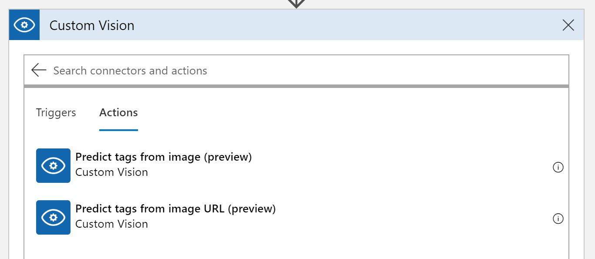

Now we need to fill in the details of the custom vision process

* **Project ID:** Find the project ID from the settings logo in the top right of the Custom Vision webpage
    * 
* **Image URL:** select the input box and on the right side select URL from Parse JSON outputs
    * 
* **Add New Parameter:** 
    * Select **Add New Parameter** drop down box
    * select the Iteration ID parameter box
    * 
    * Once selected, type **Iteration1** oryour training iteration number in the box
    * 


Choose next step

type **for each** and select the grey control step called for each
Once selected in the output from previous step box, select the box and from Dynamic content select **predictions** from the Parse JSON 2 category


Choose **Add an action**

Search Control, select the control icon and then from the results, select **Condition**


In the Condition box, select choose a value. From Dynamic content find 'Predict Tags from Image URL' and then **Probability**

Set the condition to be **Predicition Probability** greater than 0.7 (as shown below)

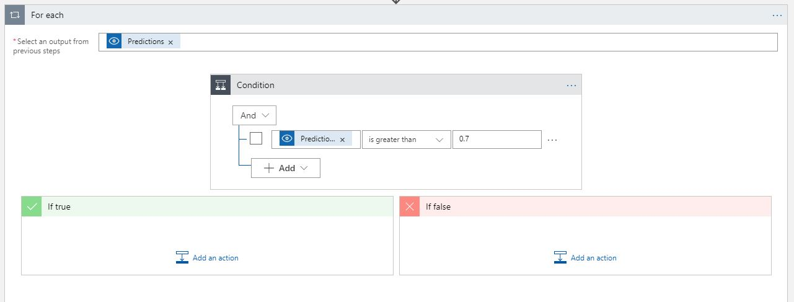

In the **If True** box select **Add an action**

Search for **outlook** and select the icon for **Office 365 Outlook**

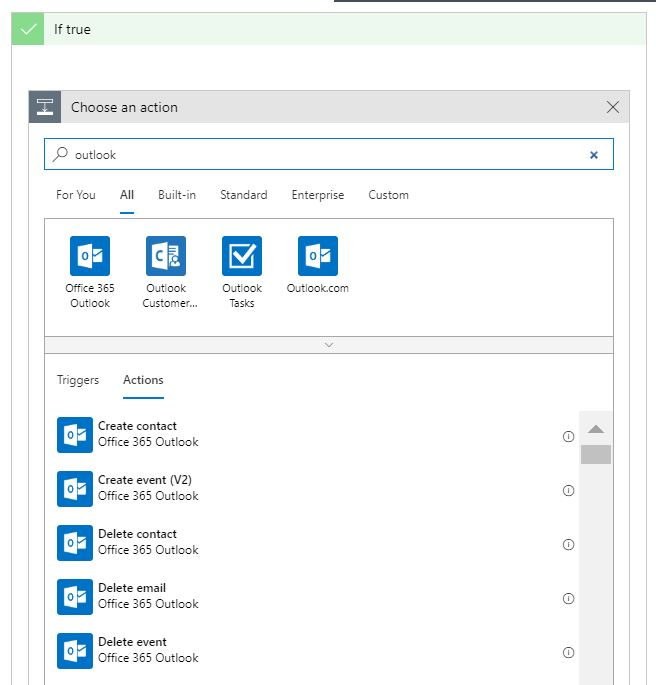

Next sign into your Outlook email account and allow it access to the logic app


Next select the **Send an Email** option - it might be easiest to search for send 


Add to the content of your email, some examples of what you could enter below:
* **To:** [your email address]
* **Subject:** Dog Classifier: you saw a [select Predictions Tag]
* Body: You saw the dog at: [select Created At]. This was a [select Predictions Tag]. I was [select Predictions Probability] confident. Image: [select url]
* **Add new parameter:** select the drop down and select **Importance** check box. Once selected - you will see **Low** as an option in the dropdown. 


Finally save the logic app in the top action bar

Once saved, lets test the app for the desired outcome. Select **Run** from the top action bar

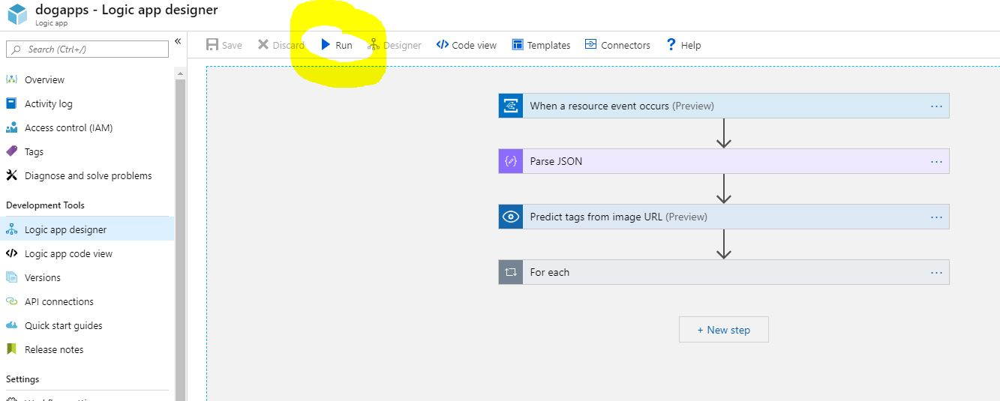

Now navigate to your images storage account (easy to find from the resource group section). 
Choose Blob and select the images container. In there you should see an upload button. Upload one of the images from the Dogs data testset folder


Once uploaded, navigate back to your Logic App main page and review the  runs history section at the bottom of the page. Select the successful run and review the inputs and outputs from the


All sections should have a green tick and you can select each one to view the input and output between the layers (this is also a great way to debug if it doesn't run as expected)

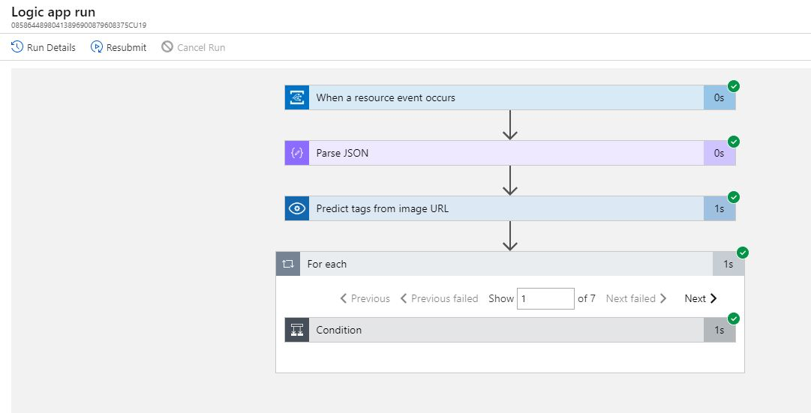

You should now have received an email containing the content about the dog picture.

Congratulations!! you created an end-to-end process using an AI service.


# Microsoft Power Apps
## Creating a front end application to take a picture of a dog and analyse it

> NOTE: you must use your organizational account to use PowerApps.

Navigate to: [https://powerapps.microsoft.com/en-us/?WT.mc_id=build2019-event-amynic](https://powerapps.microsoft.com/en-us/) and sign in with your organizational account.

This will take you to the PowerApps main menu screen. Select the **Canvas App from Blank** button


Provide an App Name, **example: Dog Spotter** and in this case select **Format:Phone**


This will load a screen like shown below. With a user interface for you to start building your application using the click-and-drag interface.


To start building our app we are going to need to insert some functionality. You will find the **insert** menu at the top of the page like below


First we are going to insert **Camera** functionality. Under the insert tab select the **Media** dropdown and select the **Camera** option


Position the camera in good place on the page and you will see a properties pane appear on the right side of the page

Choose the **Advanced** tab from the properties pane. Under **Action** and **OnSelect** insert

``` Collect(myPics, Camera1.Photo) ```

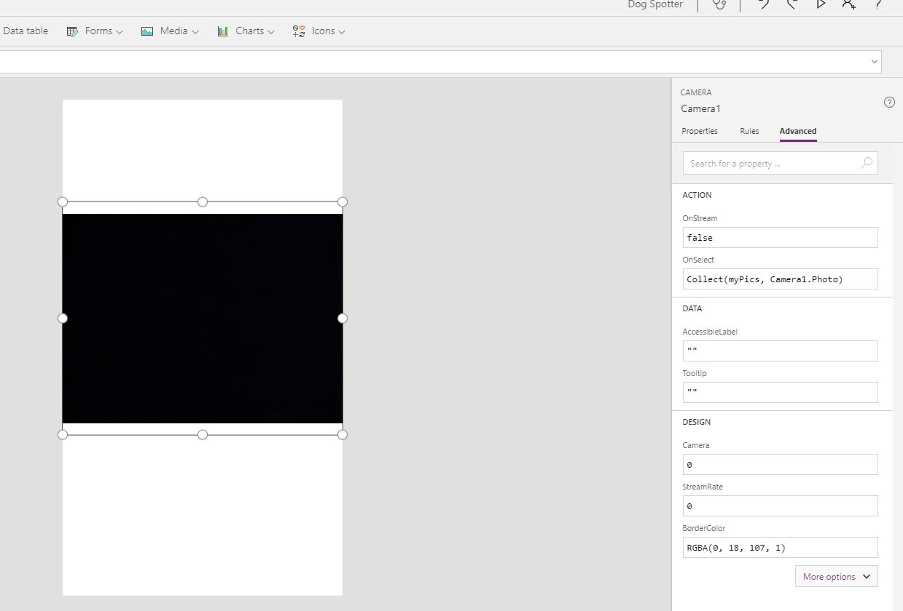

Next we are going to insert a title for the application. Go to the **insert** tab and select the **Text** dropdown menu. Under this menu select **Label**

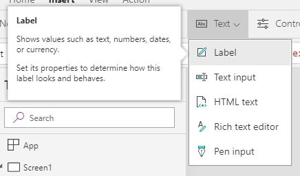

Place the Title at the top of the page. Under the properties pane on the right update the options below:
* **Text:** Dog Spotter (or another application name you would like)
* **Font Size:** 60
* **Text Alignment:** Center

> Making other changes on the properties pane will change the look and information within your app. Please investigate the options available to you. In this tutorial we will only look at a few


Now we are going to insert a **Photo Gallery**. When a photo is taken it will appear in the app at the bottom of the page.

Go to the **Insert** tab and select **Gallery**. Choose the **Horizontal** option and position the item on the page below the camera

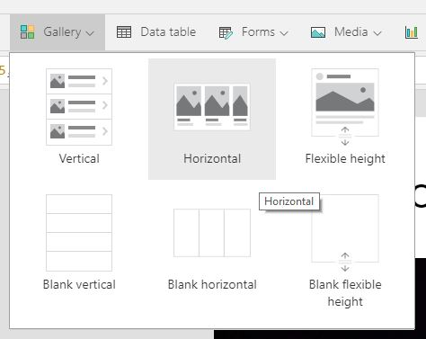

In order for the application to know which pictures to use we reuse the **myPics** variable we created in the Camera setup

On the properties pane, select **myPics** from the **Items** dropdown menu


Now select a single image slot from the gallery and on the properties pane select the **Advanced** tab. Complete the code below for the correct fields:

* OnSelect: ``` Remove(myPics, ThisItem) ```
* Image: ``` ThisItem.Url ```


Next we add a **Text Input** box from the **Text** menu on the insert tab. This box will allow us to give our image a name when we send it to Azure Blob Storage.


Align the **Text Input** box underneath the Camera and above the Image gallery

Finally add a **Button** to the page. This cna be found underneath the **Insert -> Controls -> Button** options

Place the button next to the text input box underneath the Camera


On the properties pane for the button change the **Text** field to **Send**

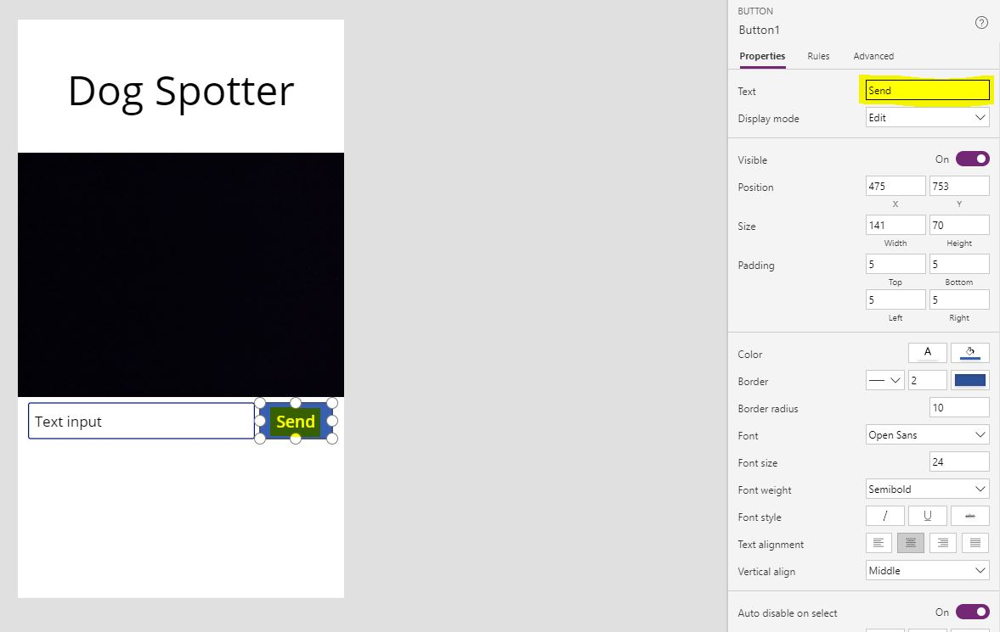

Now we need to add Azure Blob Storage as our data source. This will mean we can send the image taken by the camera in the app to storage and this will trigger our Logic app

Go to **View** in the main toolbar, then **Data Sources**. This will open a pane on the right where you can click **Add Data Source**


Select **New Connection** and search for **blob** in the search box. Then click the Azure Blob Storage option


Insert the connection information for your Azure Blob Storage account you used in the Logic App scenario: example ainightsstor.


Once authenticated you will then see your blob storage connection added to the connections pane


Now we can use this connection in a function. Click on the **Send** button and switch to the **Advanced** pane.

In the OnSelect box type: 
 ``` AzureBlobStorage.CreateFile("images", TextInput1.Text, Camera1.Photo) ```


Now we have built an app lets test it in our development environment. In the top right of the screen you will see the toolbar below - press the **Play** button highlighted. This will open a new window with your application running. This will ask for access to your camera to test the app


> Test you app by taking a picture of a dog (or anything at this point). The camera will take a picture - name it - click the send button. Once sent wait a moment and you should recieve an email as your Logic app will have triggered


Now we are going to **Save** and **Publish** the application so you can use it on your mobile device

Go to the **File** tab in to top toolbar and choose the option on the left pane **Save**. Then click the **save** button.

Once saved you will have the **Publish** button appear - select this


In order to view your published app on your phone you will need to download the PowerApps app from your app store. 

> For this tutorial the instructions will be for IOS.


Once the app is download. Open the application and log in with your organizational credentials. Once logged in you should see all your organizations apps listed


For you Dog Spotter app we want to add it to your home screen like any other application. Click on the 3 dots (...) and select **pin to home**

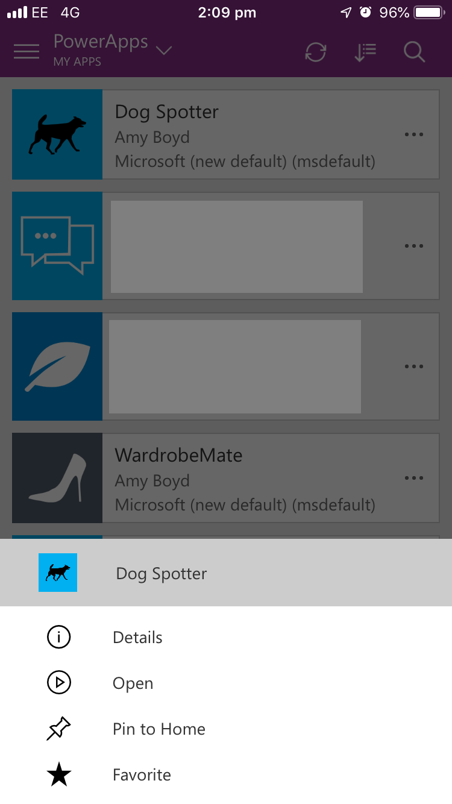

This will open the web browser where you follow the instructions to add it to your home screen. Select the share button.


Select **Add to Home Screen**


Provide your application useful name to be shown on your phone and select Add


## Congratulations!! 

The app is now added to your phone home screen and you can open and run the functionality.

Test the app by taking a picture of a dog and sending it to the cloud.

I am really keen to hear your feedback, thoughts and see the outcomes you create from this tutorial. 
Find me on Twitter: [@AmyKateNicho](https://twitter.com/AmyKateNicho) and LinkedIn: [https://www.linkedin.com/in/amykatenicho/](https://www.linkedin.com/in/amykatenicho/)


